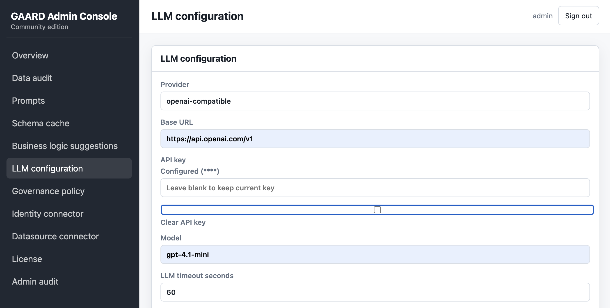
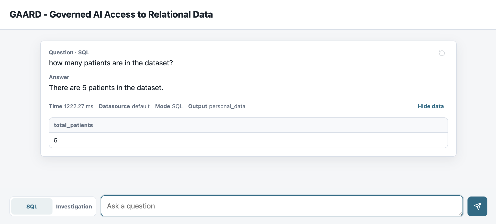

# GAARD - Governed AI Access to Relational Data

GAARD is a self-hosted AI SQL Gateway for governed natural-language access to relational data.

GAARD allows applications and users to ask questions about relational databases using
natural language while keeping SQL generation, validation, execution, prompts,
connectors, and auditability under control.

## Quick Start

The fastest local path is to run the API with Uvicorn and use the bundled SQLite
demo database.

### 1. Clone the repository

```bash
git clone https://github.com/pkroliszewski/gaard.git
cd gaard
```

If you already have the project locally, go to the repository root before
running the next commands.

### 2. Install local dependencies

```bash
python -m venv .venv
source .venv/bin/activate
pip install --upgrade pip
pip install -r requirements-dev.txt
```

### 3. Create the local demo database

From the repository root:

```bash
python examples/medical-poc/create_demo_db.py
```

This recreates `examples/medical-poc/demo.db` from:

- `examples/medical-poc/schema.sql`
- `examples/medical-poc/seed.sql`

### 4. Start the API and the Admin Panel with Uvicorn

Run this from the repository root:

```bash
uvicorn app.main:app --reload --host 0.0.0.0 --port 8000
```

The API should be available at:

```text
http://localhost:8000
```

The Admin Panel will be available at:
```text
http://localhost:8000/admin
```

### 5. Configure from the API and the admin UI

GAARD does not read `.env` for API runtime configuration. On first start it
creates `metadata.db`, seeds default prompts, runtime settings, and the bundled
demo datasource, then lets the admin UI become the source of truth.

After the API starts, log in to `/admin` with `admin` / `admin`, change the
password, and configure the datasource, LLM connection, runtime modes, prompt
templates, audit retention, and schema cache settings there.

**Most important**

Put your LLM settings here:




### 6. Start the community client

Run this from the repository root in a second terminal:

```bash
uvicorn services.client.app.main:app --reload --host 0.0.0.0 --port 8001
```

Open the client at:

```text
http://localhost:8001?backendUrl=http://localhost:8000
```

The `backendUrl` frontend parameter is the only client-side configuration
value. It points the client to the GAARD API backend.

### 7. Ask a question

Use the shipped simple client UI:



or use the API:

```bash
curl -X POST http://localhost:8000/api/v1/query \
  -H "Content-Type: application/json" \
  -d '{"question":"How many active patients are there?"}'
```

The response includes the natural-language answer, generated SQL, returned rows,
and request metadata.

## Requirements

Core local development requirements:

- Python 3.11 or newer
- `pip`
- Python virtual environment support, usually available through `venv`

Optional Docker-based runtime requirements:

- Docker-compatible runtime, such as Docker Engine or Docker Desktop
- Docker Compose, either the `docker compose` plugin or standalone `docker-compose`

Runtime configuration requirements:

- An OpenAI-compatible LLM endpoint and API key when using `llm` modes
- A relational datasource reachable through SQLAlchemy
- Local SQLite storage for GAARD metadata

## Technology Stack

- Backend API: Python + FastAPI
- Core engine: Python package
- Database abstraction: SQLAlchemy
- Metadata database: SQLite
- Demo datasource: SQLite
- Deployment: local Uvicorn or Docker Compose

## Project Structure

- `apps/` - web applications such as admin console, demo UI, and docs UI
- `services/api/` - FastAPI HTTP API
- `services/client/` - FastAPI-hosted community client UI
- `services/worker/` - background worker
- `services/scheduler/` - scheduled jobs
- `packages/gaard-core/` - query pipeline, prompts, policies, and validation
- `packages/gaard-connectors/` - SQLAlchemy-based database connectors
- `packages/gaard-llm/` - LLM provider adapters
- `config/` - prompts, policies, and semantic-layer examples
- `infra/` - deployment assets
- `docs/` - architecture, API, and operational documentation
- `examples/` - demo datasets and use cases
- `tests/` - integration, end-to-end, and prompt evaluation tests

## Configuration

The API runtime is configured through the admin UI and persisted in the SQLite
metadata database at `metadata.db`. The metadata database is the only source of
truth for prompt templates, datasource connectors, LLM settings, runtime modes,
query limits, audit retention, and schema cache settings.

The first startup seeds these defaults:

| Setting | Default |
| --- | --- |
| Metadata database | `sqlite:///./metadata.db` |
| Default datasource | `sqlite:///./examples/medical-poc/demo.db` |
| SQL dialect | `sqlite` |
| Intent classification | `auto` |
| SQL generation | `llm` |
| Result interpretation | `llm` |
| Output classification | `auto` |
| LLM provider | `openai-compatible` |
| LLM base URL | `https://api.openai.com/v1` |
| LLM API key | `change-me` |
| LLM model | `gpt-4.1-mini` |
| LLM timeout | `60` seconds |
| LLM extra body | `{}` |
| Query max rows | `100` |
| Query timeout | `30` seconds |
| Schema cache TTL | `300` seconds |
| Audit retention | `90` days |

Change these values in `/admin`; GAARD will keep using the metadata-db values
after restarts.

For automated tests or local development without an LLM key, you can seed
different initial values with process environment variables before the API
creates metadata settings, for example:

```bash
GAARD_SQL_GENERATION_MODE=mock GAARD_RESULT_INTERPRETATION_MODE=mock uvicorn app.main:app --reload --host 0.0.0.0 --port 8000
```

GAARD does not load `.env` files. Environment variables only affect code
defaults and system-seeded metadata settings; admin-edited metadata settings
remain authoritative.

## konfiguracja połączeń z bazą

Datasource connectors are configured in the admin UI and persisted in the
metadata database. For required database permissions, MySQL, PostgreSQL and
SQLite connection examples, schema introspection, views, and business logic
settings for tables and views, see
[DatasourceConfiguration.md](DatasourceConfiguration.md).

## Demo SQLite Database

The bundled demo datasource is stored at:

```text
examples/medical-poc/demo.db
```

Generate it with:

```bash
python examples/medical-poc/create_demo_db.py
```

The script removes the previous `demo.db`, creates the schema from
`examples/medical-poc/schema.sql`, and loads data from
`examples/medical-poc/seed.sql`.

If you prefer to run the SQL files manually and have the `sqlite3` CLI
available:

```bash
rm -f examples/medical-poc/demo.db
sqlite3 examples/medical-poc/demo.db < examples/medical-poc/schema.sql
sqlite3 examples/medical-poc/demo.db < examples/medical-poc/seed.sql
```

The first API startup creates a default datasource connector for this database.
You can replace or edit it from the admin UI.

## Run with Docker Compose

Docker is optional. Use this path when you want to run the API in a container
with local SQLite metadata storage.

To build images on one machine, transfer them, and run them with Podman on
another machine, see [Compiling Docker Images for Transfer](CompilingDockerImages.md).

GAARD stores admin users, prompt templates, audit logs, datasource connector
settings, schema cache entries, and admin settings in a local SQLite metadata
database. Persist the SQLite file outside the container if you want metadata to
survive container rebuilds and restarts.

### 1. Prepare the demo datasource

Generate the demo SQLite database before building the Docker image, because the
current API image copies the `examples/` directory at build time:

```bash
python examples/medical-poc/create_demo_db.py
```

Runtime configuration is created in the SQLite metadata database on first API
start and then managed from `/admin`.

### 2. Build and start services

If your environment uses Docker Compose v2:

```bash
docker compose up --build
```

If your environment uses standalone Docker Compose:

```bash
docker-compose up --build
```

The API should be available at:

```text
http://localhost:8000
```

### 3. Check health

```bash
curl http://localhost:8000/health
curl http://localhost:8000/api/v1/health
```

Expected response:

```json
{
  "status": "ok"
}
```

### 4. Stop services

```bash
docker compose down
```

Use `docker-compose down` if your environment uses standalone Docker Compose.

To remove persisted metadata as well, delete the local SQLite metadata file or
the mounted data volume explicitly.

## Run Locally with Uvicorn

Use this path when you want to run the API directly on your machine without
Docker.

### 1. Prepare the demo datasource

```bash
python examples/medical-poc/create_demo_db.py
```

Runtime configuration is seeded into `metadata.db` when the API starts.

### 2. Create and activate a virtual environment

```bash
python -m venv .venv
source .venv/bin/activate
```

### 3. Install dependencies

```bash
pip install --upgrade pip
pip install -r requirements-dev.txt
```

This installs local GAARD packages in editable mode:

- `packages/gaard-core`
- `packages/gaard-connectors`
- `packages/gaard-llm`
- `services/api`

### 4. Start the API

Run this from the repository root so relative datasource paths resolve correctly:

```bash
uvicorn app.main:app --reload --host 0.0.0.0 --port 8000
```

### 5. Check health

```bash
curl http://localhost:8000/health
curl http://localhost:8000/api/v1/health
```

## Query Endpoint

Send a natural-language question to:

```text
POST /api/v1/query
```

Example:

```bash
curl -X POST http://localhost:8000/api/v1/query \
  -H "Content-Type: application/json" \
  -d '{"question":"How many active patients are there?"}'
```

The response shape is:

```json
{
  "question": "How many active patients are there?",
  "answer": "...",
  "sql": "...",
  "rows": [],
  "metadata": {
    "datasource_id": "default",
    "user_id": "local-admin",
    "confidence": 0.0,
    "mode": "llm"
  }
}
```

Exact SQL, answer text, rows, confidence, and duration metadata depend on the
configured model, datasource, and query.

## Admin Portal

The admin portal is served by the API at:

```text
http://localhost:8000/admin
```

The default bootstrap administrator is:

```text
username: admin
password: admin
```

The first login requires a password change before the rest of the admin portal
can be used.

The current admin surface includes:

- administrator login and password change
- data query audit log with retention settings
- prompt template management stored in metadata
- schema cache TTL management and invalidation
- placeholder modules for identity, datasource connectors, SQL validation rules, result interpretation policies, and licensing
- admin audit events for management actions

## Community Client

The community client is a separate Uvicorn app named `client`. It provides a
chat-style UI for asking questions against the GAARD backend.

Start the API first, then run the client from the repository root:

```bash
uvicorn services.client.app.main:app --reload --host 0.0.0.0 --port 8001
```

Open:

```text
http://localhost:8001?backendUrl=http://localhost:8000
```

The client sends questions to the backend's default query endpoint:

```text
POST /api/v1/query
```

Only the backend URL is configurable for the client. You can set it per browser
session with the `backendUrl` query parameter or provide a default with:

```env
GAARD_CLIENT_BACKEND_URL=http://localhost:8000
```

After each question, the client shows the question, answer, processing time,
`datasource_id`, and `output_classification`. The input stays fixed at the
bottom while previous answers remain visible as history.

## Running Tests

GAARD uses `pytest` for Python tests. Because the project is organized as a
monorepo with local editable packages, run tests inside a Python virtual
environment.

### 1. Create and activate a virtual environment

From the repository root:

```bash
python -m venv .venv
source .venv/bin/activate
```

Check the Python version:

```bash
python --version
```

### 2. Install development dependencies

```bash
pip install --upgrade pip
pip install -r requirements-dev.txt
```

### 3. Run tests

Run the full test suite:

```bash
pytest
```

Run a package test suite:

```bash
pytest packages/gaard-core/tests
pytest packages/gaard-connectors/tests
pytest packages/gaard-llm/tests
pytest services/api/tests
```

Run a single test file:

```bash
pytest packages/gaard-core/tests/test_sql_validator.py
```

Run tests with verbose output:

```bash
pytest -v
```

### 4. Run linting

```bash
ruff check .
```

### 5. Troubleshooting

If imports such as `gaard_core`, `gaard_connectors`, or `app` are missing, make
sure the virtual environment is active and development dependencies were
installed:

```bash
source .venv/bin/activate
pip install -r requirements-dev.txt
pytest
```
